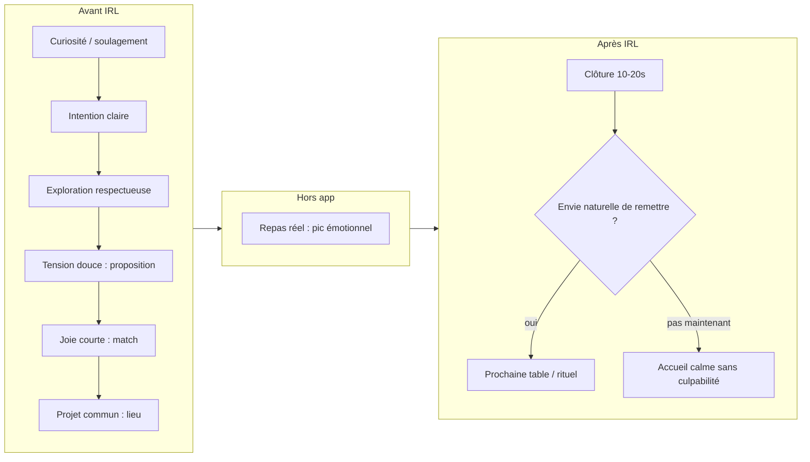

# Paye ta graille — Système d’engagement naturel (v1)

**Mission** : concevoir un engagement où les gens **reviennent pour vivre quelque chose de réel**, pas parce qu’ils sont **piégés** dans l’écran.  
**Équipe fictive alignée** : neurosciences motivation & apprentissage · psychologie cognitive & comportementale · UX forte rétention (référence qualité Airbnb/Duolingo **sans** copier leurs angles addictifs) · design émotionnel · engagement digital **responsable** · interaction sociale IRL.

**Règle finale (gating)** : chaque mécanisme doit répondre oui à :

> *« Est-ce que cela améliore la vie réelle de l’utilisateur ? »*

Sinon → **ne pas intégrer** (ou reformuler jusqu’à ce que la réponse soit oui).

**Documents liés** (ne pas les contredire) : `RETENTION_ETHICAL.md` · `HUMAN_EXPERIENCE.md` · `PRODUCT_SPEC.md` · `UX_COPY_SYSTEM.md` · `MODULE_TABLE_SURPRISE_SPEC.md` · `MODULE_REPAS_SUSPENDU.md` · **`PROMPT_ENGAGEMENT_NEURO_MULTI_SENSORIEL.md`** (lexique §1, viralité / franchise / K-factor §4, patterns bannis §5, méga-prompt §6, table synthèse §7).

**Objectif ultime (brief engagement responsable)** : une app que les gens **aiment utiliser**, pas dont ils deviennent **dépendants** — ils reviennent pour **vivre quelque chose de réel** (table), pas parce qu’ils sont **piégés** dans l’écran.

### Carte lecture — livrable « système d’engagement »

| Livrable demandé | Section ci-dessous |
|--------------------|-------------------|
| Boucles de retour naturelles | **§1** |
| Moments émotionnels forts | **§2** |
| Mécaniques sociales positives | **§3** |
| Progression humaine | **§4** |
| Récompenses non addictives | **§5** |
| Parcours utilisateur émotionnel | **§6** |
| Suggestions UX concrètes | **§7** |
| Rétention saine / métriques | **§8** |
| Alertes / ce qu’il faut éviter | **§9** |

Copy opérationnelle : `src/lib/micro-moments-copy.ts` · nudge levels profil / `user_settings`.

---

## 0) Cadre scientifique & produit (court)

### Motivation saine vs compulsion

- **Motivation alignée** : anticipation d’un **événement social réel** (repas), **autonomie** (choix, refus sans punition), **compétence** (proposition simple qui aboutit), **relation** (SDT — *Self-Determination Theory*).
- **Compulsion** : ouverture app déclenchée par **anxiété**, **culpabilité**, **peur de perdre** un statut artificiel — **à éviter absolument**.

### Apprentissage & habitude (sans casino)

- Le cerveau consolide les **habitudes** quand **signal → action → résultat** est **stable** et **récompensant**. Ici le résultat doit être **majoritairement hors app** (table).
- **Fogg (MAP)** : *Behavior = Motivation × Ability × Prompt* — les prompts (notifications, rappels écran) n’arrivent que si **M** est déjà là (ex. repas confirmé, créneau choisi) et **A** est maximal (1 tap, texte clair).

### Ce que l’app “vend” émotionnellement

| Émotion cible | Où | Comment (résumé) |
|---------------|-----|-------------------|
| **Soulagement** | onboarding, match | clarté, cadre, pas de piège |
| **Curiosité** | explorer, table surprise | profils / mystère **consenti** |
| **Surprise** | jour J, lieu, hôte | **réel**, pas animation creuse |
| **Satisfaction sociale** | post-repas, rituel | reconnaissance **douce**, pas vanity |

---

## 1) Boucles de retour **naturelles**

*Pourquoi la personne revient **sans** y être “forcée” par un système artificiel ?*

| ID | Boucle | Déclencheur naturel | Action dans l’app (minimale) | “Récompense” réelle | Garde-fou |
|----|--------|---------------------|------------------------------|---------------------|-----------|
| **N1** | **Prochaine table** | Fin de repas agréable | Proposer **1 créneau** ou **1 contact** (max 2 options) | Anticipation sociale **légitime** | **« Plus tard »** toujours visible ; pas de faux compte à rebours |
| **N2** | **Rituel temporel** | Même jour / même quartier | Rappel **opt-in** “table du mercredi” | Habitude **calendrier**, pas scroll | Fréquence plafonnée ; réglages nudges (`PRODUCT_SPEC`) |
| **N3** | **Obligation utile** | Repas `confirmed` | Rappels **J-24 / J-2h** (infos lieu, accès Maps) | Réduction stress **IRL** | Jamais la nuit sauf urgence sécurité |
| **N4** | **Invitation humaine** | Ami hors app ou dans l’app | Lien de parrainage / “viens sur ma table” | Lien **social authentique** | Pas de spam multi-relances |
| **N5** | **Densité locale** (V1.5+) | “Ce soir dans mon quartier” | Feed **léger** + réponse sous annonce | Opportunité **réelle** | Quotas anti-spam ; pas de FOMO chiffré mensonger |
| **N6** | **Progression relationnelle** (V2) | 2e, 3e repas avec la même personne | Jauge **privée** + libellés doux type “compagnon de graille” | Continuité **humaine** | **Pas** de classement public ; pas de perte punitives |

**Principe** : la boucle se referme sur **un moment IRL daté** — pas sur “une récompense numérique gratuite”.

---

## 2) Moments émotionnels **forts** (scènes produit)

Aligné `HUMAN_EXPERIENCE.md` (M1–M6), enrichi **mécaniquement** :

| Scène | Émotion | UX concrète | Ce qu’on ne fait pas |
|-------|---------|-------------|----------------------|
| **Découverte** | curiosité + soulagement | 1 phrase promesse + intention sociale explicite | mur de features |
| **Match “c’est oui”** | joie courte | plein d’air, animation **douce**, rappel des règles IRL | confettis agressifs, pression “réponds en 60 s” |
| **Lieu confirmé** | projet commun | carte, options claires, rôle hôte/invité | ping-pong infini de choix |
| **Jour J** | anticipation saine | écran **Jour J** : heure, lieu, CTA Maps, signalement | notifs marketing |
| **Pendant repas** | *(hors app)* | mode “table” optionnel : **silence** notifié | streak “ouvre l’app” |
| **Post-repas** | clôture digne | 10–20 s max : humeur + **option** merci + prochaine table | enquête 15 écrans |
| **Table surprise** (module) | curiosité **consentie** | cadre **avant** personne ; double validation ; reveal prudent | mystère sur identité sans cadre sécurité |
| **Repas suspendu** (module) | générosité | transparence don / impact ; pas de pression honte | nudges obscurcis sur montant |

---

## 3) Mécaniques sociales **positives**

| Mécanique | But | Implémentation (rappel spec) | Risque si mal fait |
|-----------|-----|-----------------------------|---------------------|
| **Duo repas** (V1) | premier “oui” réaliste | machine d’états + chat **conditionnel** | harcèlement → modération + signalement |
| **Intentions** (invite / partage / invité) | clarté du pacte | 3 boutons + copy cohérente | ambiguïté → dette affective |
| **Repas ouvert** (V1.5) | spontanéité locale | annonces typées + threads limités | bruit / spam |
| **Groupe + potluck** (V2) | convivialité | “qui ramène quoi” **uniquement** formats concernés | charge mentale |
| **Repas croisé** (V2) | élargissement **contrôlé** | double opt-in + graphe invisible | exposition réseau |
| **Contacts graille** | continuité **choisie** | opt-in **mutuel** post-repas | liste de “proies” |

**Fil conducteur** : chaque mécanique augmente la **probabilité d’un contact respectueux**, pas la **compétition**.

---

## 4) Progression **humaine** (pas de “niveau 99” toxique)

| Type de progression | Visible comment | Pourquoi c’est sain |
|---------------------|-----------------|---------------------|
| **Historique de tables** | liste sobre (lieu, date, personne masquable) | mémoire **réelle** |
| **Rituels nommables** | “mercredi / quartier X” en favori | ancrage **temps réel** |
| **Relations** | contacts graille **avec consentement** | graphe social **explicite** |
| **Impact** (repas suspendu) | preuve d’usage des fonds / table offerte | sens **collectif** |
| **Jauge privée** (V2) | paliers textuels entre **deux** personnes | fierté **intime**, pas leaderboard |

**Interdits** : XP public, perte de niveau, “tu descends de ligue”, comparaison followeurs.

---

## 5) Récompenses **non addictives**

| Récompense | Rôle | Règles |
|------------|------|--------|
| **Badge symbolique** | fierté douce (“première table”, “hôte accueillant”) | opt-in affichage ; aucun avantage pay-to-win |
| **Souvenir visuel** | carte stylisée **sans visages** | export **opt-in** ; jamais auto-post RS |
| **Reconnaissance sociale** | message merci **privé** | pas de forced gratitude |
| **Accès features** | débloquer groupe / événement après **repas complété** | lié à **comportement réel**, pas temps d’écran |
| **Statut resto / partenaire** | confiance B2B | vérité terrain, pas faux labels |

**Test** : si la récompense disparaît demain, est-ce que l’utilisateur **perd quelque chose d’humain** ? Si oui **uniquement** parce que c’était un **souvenir** — bon signe. Si la perte est **“mon score”** — mauvais signe.

---

## 6) Parcours utilisateur **émotionnel** (synthèse)

**Point d’attention** : le **pic** est **G** ; l’app ne doit pas voler le pic avec sur-stimulation.

---

## 7) Suggestions **UX concrètes** (par surface)

| Surface | À faire | Détail |
|---------|---------|--------|
| **Accueil** | **1 action primaire** contextuelle | Si repas à venir → Jour J ; sinon → proposer / explorer / inviter (pas feed infini seul) |
| **Notifications** | **3 niveaux** calme / normal / off | pas de notif pour “revenir voir” sans événement réel |
| **Match** | **écran de respiration** | CTA clairs : lieu + chat si autorisé |
| **Chat** | **cadre** rappelé en header | signalement 1 tap ; pas de réception lecture forcée |
| **Refus** | **refus élégant** copy | préserve dignité des deux côtés |
| **Post-repas** | **micro-feedback** + sortie | “Plus tard” = fin de session honorée |
| **Réglages** | **contrôle total** des nudges | transparence sur ce qui déclenche quoi |
| **Accessibilité** | motion réduite, contrastes | émotion ≠ surcharge sensorielle |

---

## 8) Rétention **saine** — métriques & signaux

**À maximiser** (aligné `RETENTION_ETHICAL.md`) :

- Repas **complétés** / utilisateur actif / mois  
- Délai jusqu’au **2e** repas (qualité)  
- Taux de retour **J+28** après **1** repas complété  
- **Show-up** / respect du cadre  

**À ne pas idolâtrer** :

- Temps passé **dans** l’app  
- Ouvertures **sans** intention IRL  

**Question quali** (entretiens) : *« Tu te sens obligé·e d’ouvrir l’app ? »* — si **oui pour mauvaises raisons** → audit nudges.

---

## 9) Alertes — **ce qu’il faut éviter** (consolidé)

| Zone rouge | Exemple | Alternative |
|------------|---------|-------------|
| Dark patterns | désinscription cachée, consentement pré-coché | chemins clairs, copies honnêtes |
| Peur / frustration | “X va annuler si tu ne…” | faits **seulement** si vrais + ton neutre |
| Streaks punitifs | perte de série | rituels **calendaire** positifs |
| Renforcement casino | loot boxes, récompenses aléatoires payantes | variété **annoncée** (lieux, gens) |
| Comparaisons toxiques | top hôtes public | reconnaissance **locale** opt-in |
| Exploitation corps / honte | push image / poids | neutralité, santé = infos lieu |
| Surveillance | “en ligne maintenant” | statuts **grossiers** ou absents |
| Pression don | repas suspendu flou | transparence impact + montant libre |

---

## 10) Synthèse une phrase (interne / pitch équipe)

> **Paye ta graille** retient parce que la **prochaine table** est **réelle**, **datée**, et **socialement désirable** — l’app **réduit la friction** jusqu’au repas puis **se fait discrète**, au lieu de **fabriquer une dette d’écran**.

---

*v1 — valider par tests utilisateurs + revue juridique modules sensibles.*
